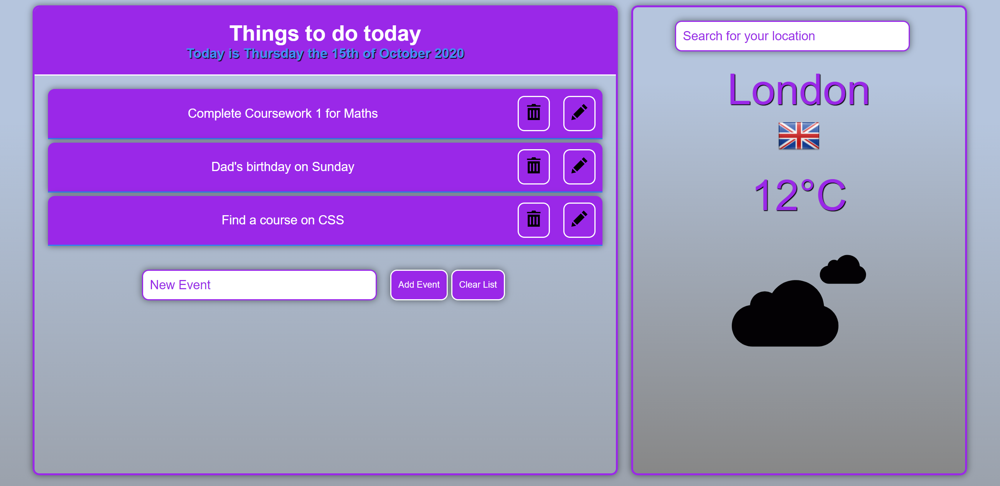
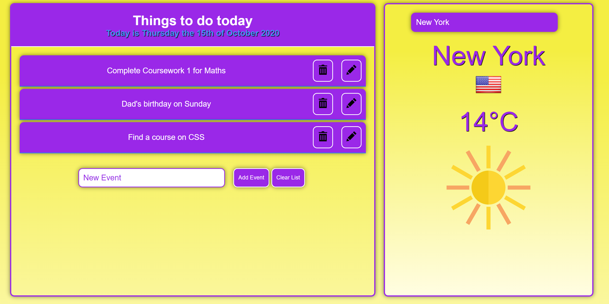

# todoAndWeatherApp
Simple Todo List and Weather App (Vanilla JS)

The weather and todo list apps are very common amongst front-end developers, who wish to start practicing their skills in JavaScript, HTML and CSS. The project shows some basics of using vanilla JavaScript (no frameworks) to make the website interactive, store input data and fetch weather and flag data from APIs usign Fetch. 
This project allows a user to do the following:

1. Fetch current weather data from the API offered by https://openweathermap.org/, and update styling in response to weather conditions. Also, as an extra feature, the entered country's flag is fetched from the API offered by https://www.countryflags.io.
2. Add, edit, delete notes/events to the daily event list. The list is stored on user's computer using LocalStorage(), so the data is not lost after closing the tab.

